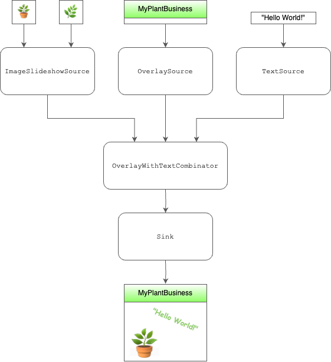

# Video Template Builder


This framework allows you to create custom video templates using static images and metadata, making it easier and more efficient to produce video content on a larger scale.

## Design

This framework uses a pull-based approach to gather frames from various sources and combine them as intended. The model is straightforward: it involves the use of `Source` class implementations. As an end user, you are responsible for creating custom versions of these classes - if not already provided - and managing their usage.



## Implementation

This repository contains files which can be extended for custom implementations.

- `source.py` contains the basic definition for the `Source` class and sample `ImageSlideshowSource` and  `SingleMediaSource` implementations.

- `combinator.py` contains a sample `Source` subclass that combines two other sources to form a single one. It is important to note that `Combinator`s are also `Source`s themselves, and can be further combined by other `Source`s, they are placed in a different file for responsibility segregation reasons.

- `sink.py` pulls frames from a single final source to create an output `.mp4` file. It supports adding audio files as well.


## Requirements

To ensure a clean workspace and avoid potential conflicts between dependencies, it's highly recommended to use a virtual environment. You can also skip directly to step 3.

1. The following command creates a new virtual environment named `myenv`.

```bash
python3 -m venv .env
```

2. Once the environment is created, you can activate it using:

```bash
source .env/bin/activate
```

3. Install the necessary dependencies.

```bash
pip install -r requirements.txt
```
This command installs all the packages listed in the `requirements.txt` file into your active environment.

## Sample

`main.py` contains a simple usage example for these classes. This sample use case pulls three images from the web and creates a slideshow with a background image.

- The Instagram and Facebook logos are used to create a looping slideshow
- The WhatsApp logo is used as a background image.

The slideshow component has dimensions 550x550 whereas the background (and final video) has dimensions 700x700. The slideshow component is centered using a margin combinator.

The background could be a video as well without changing the API, but in this example we are using a static image.

This sample use case could be enriched with custom creatives, and create a script that creates product slideshows and custom frames that enhance brand identity.

## License
This project is MIT licensed, as found in the LICENSE file.
